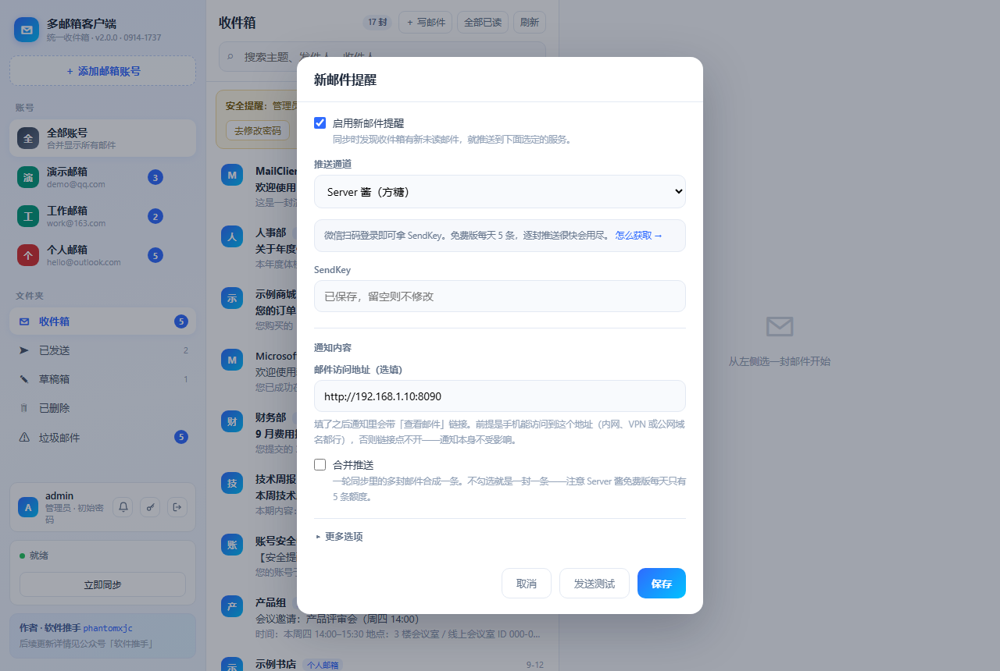
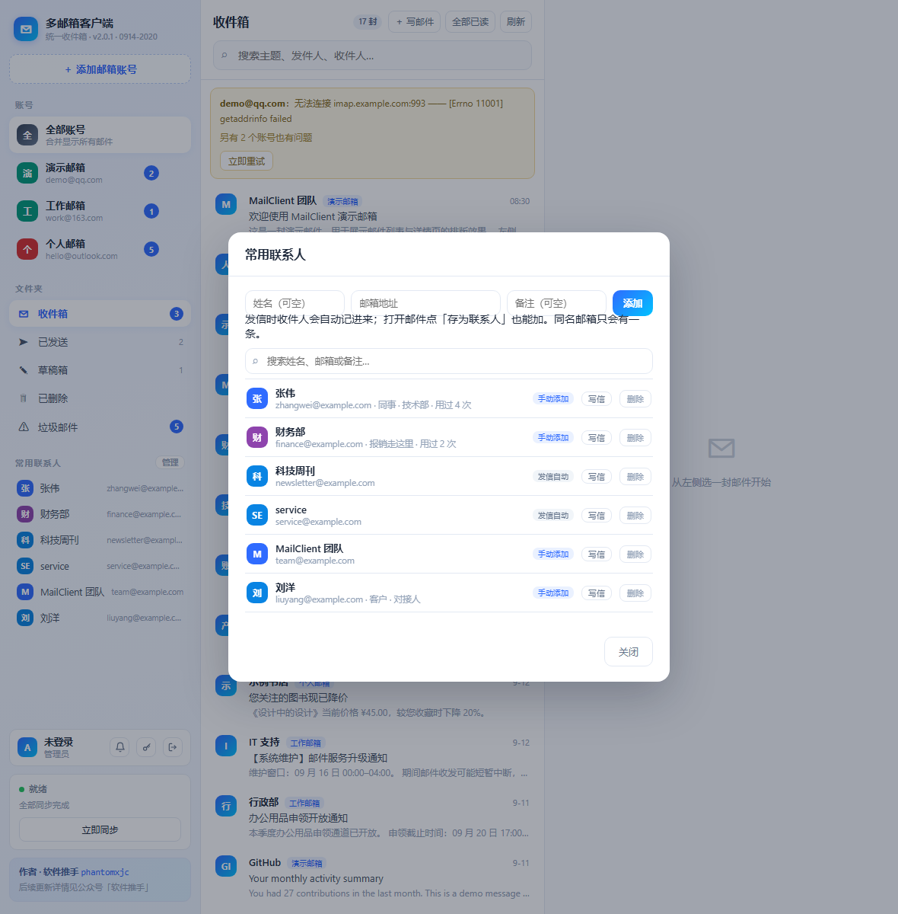
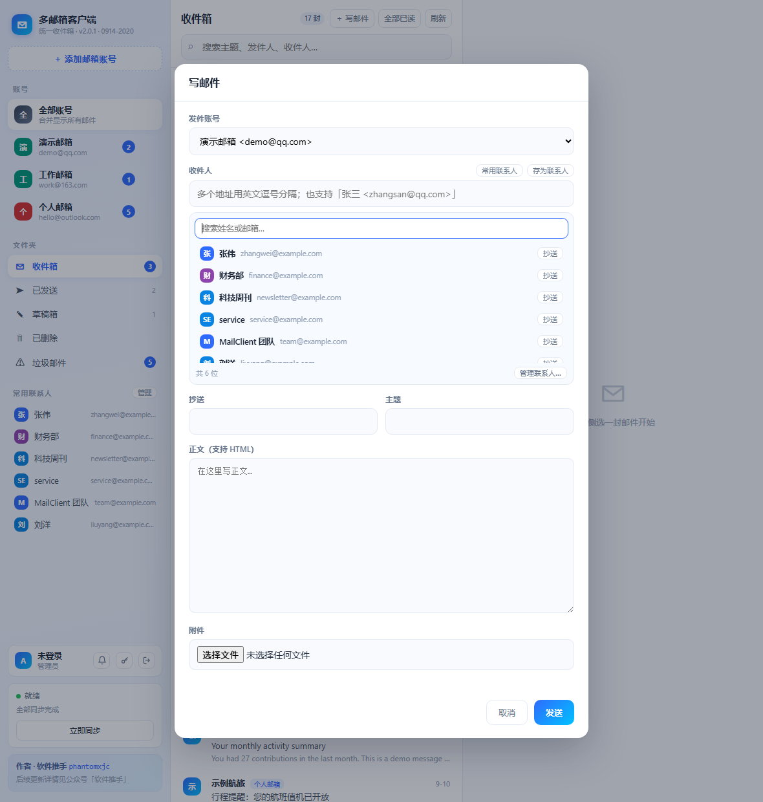
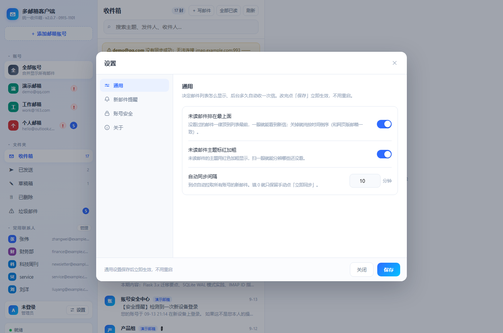
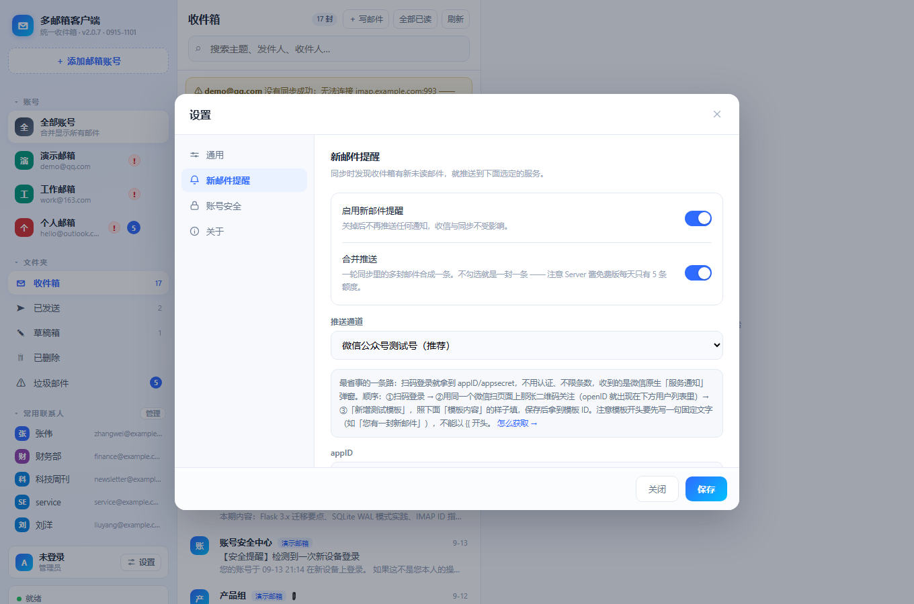
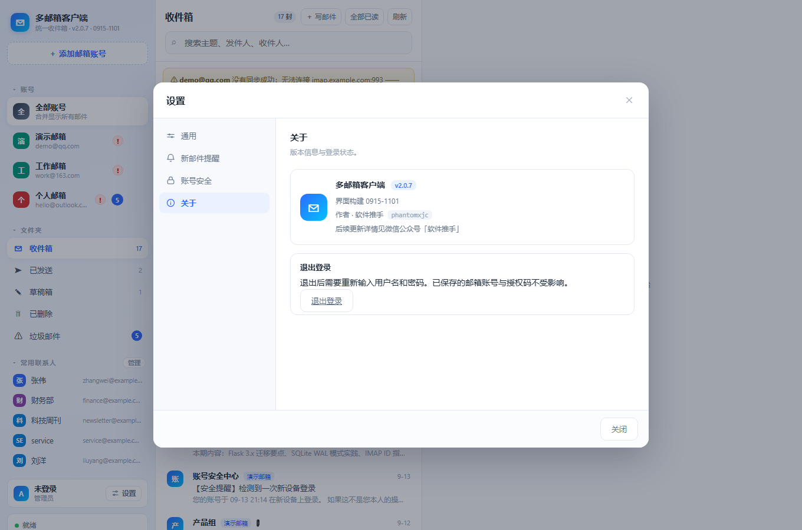
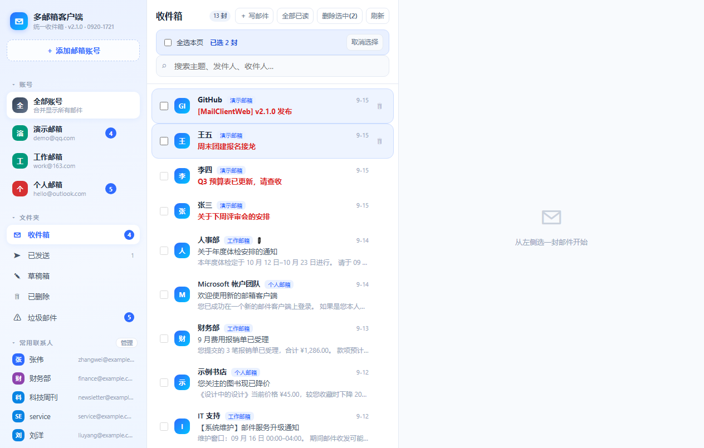

# 星尘邮箱 · 多邮箱统一收件箱（Flask 版）

> **v2.2.0 更名说明**：本项目原名为「MailClient Web」，自 2.2.0 起正式更名为 **星尘邮箱（Stardust Mail）**，
> GitHub 仓库同步更名为 `StardustMail`。安装包名（FNOS `appname`）为 `stardust`，
> 容器 / 镜像名统一为 `stardust`，飞牛数据目录迁移至 `/var/apps/stardust/shares/stardust/data`。
> 功能与配置项保持一致（`DATA_DIR` 环境变量、`admin/admin123` 初始账号、8090 端口均未变）。

把桌面版（PySide6）的多邮箱客户端搬到了浏览器里，一台机器跑起来，
手机、平板、公司电脑都能打开同一个收件箱。协议层（IMAP / OAuth2 / 解析）与桌面版同一套，
只是把 QThread 换成了普通线程、把 keyring 换成了加密的 SQLite 存储。


## 能做什么

- **多账号合并收件箱**：左栏按账号 + 文件夹（收件箱 / 已发送 / 草稿箱 / 已删除 / 垃圾邮件）过滤，中栏列表，右栏详情
- **真实同步**：`UID SEARCH` + `UID FETCH`，一次同步 5 类文件夹；用 `BODY.PEEK[]` 保证**不会把你的邮件偷偷标成已读**
- **已读回写**：在网页上点开邮件，状态会推回 IMAP 服务器
- **写 / 发邮件**：支持抄送、密送、附件；已发送会自动 `APPEND` 到服务器「已发送」
- **微软账号 OAuth2**：Outlook / Hotmail / M365 走设备码流程（`XOAUTH2`），不再受「基础认证已停用」影响
- **账号管理**：添加账号时**自动按邮箱后缀识别服务商**（内置 QQ / 网易 / Outlook / Gmail / 新浪 / 阿里 / 139 / 企业邮 / 189 / iCloud / Yahoo 等 15 种预设）；在左侧账号上**右键**，或点该行右侧的 **⋯**，都可以「同步此账号 / 删除账号」（删除会一并清除该账号的本地邮件、文件夹与凭据）
- **密码加密落库**：QQ / 163 等授权码用 Fernet 对称加密存在库里，密钥独立成文件
- **账号密码登录**：用户名 + 密码进入，首次启动自动建管理员 `admin / admin123`，登录后可在左下角**修改密码**（详见「登录与账号」）；密码 PBKDF2-SHA256 加盐哈希存库，连续失败 5 次锁定 5 分钟
- **常用联系人**：发信时的收件人会**自动攒下来**（按使用次数排序），也能在邮件里点「存为联系人」或手动添加；写信时点「常用联系人」即可搜索、一键填入收件人/抄送（详见「常用联系人」）
- **新邮件提醒**（可选）：收件箱来新邮件时，通过**你自己申请**的推送服务发到手机——**微信公众号测试号**（推荐，免认证、不限条数）/ Server 酱 / PushPlus / Bark / 企业微信·钉钉·飞书群机器人 / 任意 Webhook。不走浏览器通知——内网 `http://` 访问拿不到通知权限；推送用的密钥与邮箱授权码一样加密存库（详见「新邮件提醒」）


右键任意账号行，或点该行右侧的 ⋯，都可以打开同一个菜单：


## 目录结构

```
StardustMail/
├── app.py            # Flask 主程序：页面 + JSON 接口
├── config.py         # 数据目录、服务商预设、运行参数
├── auth.py           # 登录用户：建号 / 密码哈希 / 失败限流 / 改密码
├── db.py             # SQLite 存储层（账号 / 邮件 / 附件 / 凭据 / 文件夹映射 / 登录用户）
├── accounts.py       # 密码加密存储（Fernet）
├── mail_conn.py      # IMAP 连接、鉴权、文件夹自动发现
├── parser.py         # 邮件解析与按文件夹拉取
├── oauth.py          # 微软 OAuth2 设备码流程
├── msauth.py         # 把设备码流程包成「发起 → 轮询状态」两个接口
├── sender.py         # SMTP 发信（附件走内存字节）
├── sync.py           # 后台同步线程 + 可轮询状态
├── templates/        # index.html（三栏）、login.html
├── static/           # app.css、app.js（原生 JS，无构建步骤）
├── Dockerfile
├── docker-compose.yml
├── packaging/fnos/   # 飞牛 .fpk 打包工程
│   ├── manifest          # 应用元信息（名称 / 版本 / 端口 / 桌面入口）
│   ├── config/           # privilege（运行身份）、resource（docker 项目 + 数据共享目录）
│   ├── cmd/              # 生命周期脚本：安装 / 升级 / 卸载 / 启停状态
│   ├── wizard/install    # 安装向导（填初始密码、同步间隔、基础镜像地址）
│   ├── app/docker/       # FPK 用的 compose + 随包源码（打包时自动同步）
│   │   ├── base-image.tar.gz       # 离线基础镜像 python:3.12-slim（约 44 MB，见下文）
│   │   └── ensure-base-image.sh    # 安装时导入/校验基础镜像，网络不可用时兜底
│   ├── app/ui/           # 桌面图标与入口配置
│   ├── fetch-base-image.py  # 从国内镜像站取基础镜像，组装成 docker save 格式
│   ├── build-fpk.py      # 一键打包 + 自检
│   └── fnpack.exe        # 飞牛官方打包工具
├── tests/            # 自测脚本（见「怎么自测」）
│   ├── test_send_and_contacts.py   # 收件人解析 / 发信链路 / 联系人（用桩 SMTP，不联网）
│   └── e2e_ui.js                   # 真浏览器端到端（CDP，零依赖）
├── dist/             # 打包产物：stardust.fpk
└── docs/             # 界面截图
```

### 怎么自测

```bash
# 后端：45 项断言，桩掉 socket 跑真 smtplib 编码，不联网、不建号
python tests/test_send_and_contacts.py

# 前端：另开一个终端先把服务起起来，再跑（25 项，真点按钮真调接口）
python app.py &            # 或 docker compose up -d
node tests/e2e_ui.js http://127.0.0.1:8090/
```

`tests/test_send_and_contacts.py` 里那套「假 SMTP」值得说明一下：它继承真的
`smtplib.SMTP`，只把「写 socket / 读响应」换掉，**编码逻辑一行没改** —— 所以它能
复现出真机上才会出现的 `codec can't encode` 这类错误（用纯 mock 是测不出来的）。

## 一、本地直接跑（不用 Docker）

```bash
# 1) 装依赖（建议用虚拟环境）
python -m venv .venv && .venv/Scripts/activate      # Windows
pip install -r requirements.txt

# 2) 起服务（无需任何环境变量，首次启动会自动建管理员账号）
set APP_PORT=8090
python app.py
```

**Linux / macOS：**

```bash
python3 -m venv .venv && source .venv/bin/activate
pip install -r requirements.txt
APP_PORT=8090 python app.py
```

打开 `http://127.0.0.1:8090`，用 **admin / admin123** 登录（登录后请到左下角「修改密码」更换）。
默认数据落在项目下的 `data/` 目录。

> 想跳过初始密码、在第一次启动就直接设成自己的密码？
> 设 `AUTH_PASSWORD=你的强密码` 再启动（**只影响首次建号**，之后改密码都在界面上做）；
> 不想在命令行写明文，就把它写进文件：`AUTH_PASSWORD_FILE=./data/.auth`。

## 二、Docker 部署（推荐）

```bash
# 1)（可选）预设初始密码；不设则首次登录用 admin / admin123
echo AUTH_PASSWORD=你的强密码 > .env

# 2) 构建并启动
docker compose up -d
docker compose logs -f          # 看日志
```

> **不想自己构建？** 仓库自带 GitHub Actions：推到 `main` 就会自动构建镜像并发布到
> `ghcr.io/<你的用户名>/stardust`。首次发布后记得去
> **GitHub → 你的 Packages → stardust → Package settings → Change visibility** 改成 Public，
> 别人才能直接 `docker pull`。一条命令就能跑起来：
>
> ```bash
> docker run -d --name stardust -p 8090:8090 -v ./data:/data \
>   ghcr.io/<你的用户名>/stardust:latest
> ```
```

打开 `http://<机器IP>:8090` 登录。

### 让部署「跟着推送自动更新」（推荐用 GHCR + Watchtower）

如果你希望**推代码到 GitHub 之后，NAS 上的 Docker 自己更新到新版**，用这条链路：

```text
git push 到 main
   └─ GitHub Actions（.github/workflows/docker-publish.yml）自动构建并推
        ghcr.io/phantomxjc/stardust:latest
             └─ NAS 上的 Watchtower 发现镜像变了 → 自动拉取并重建容器
```

一次性配好：

```bash
# 1) 在 NAS 上改用「拉镜像」的 compose（无需本地构建）
docker compose -f docker-compose.ghcr.yml up -d

# 2) 想让容器跟着镜像自动更新，就用带 watchtower 的那份
docker compose -f docker-compose.autoupdate.yml up -d
```

`docker-compose.autoupdate.yml` = 上面那份 + 一个 Watchtower 服务（默认每 5 分钟检查一次，
只盯着 `stardust` 这一个容器，不会动别的）。以后你只管 `git push`，
几分钟后 NAS 上的版本就自动跟上了。

> 不想用 Watchtower，也可以手动一条命令更新：
> ```bash
> docker compose -f docker-compose.ghcr.yml pull && docker compose -f docker-compose.ghcr.yml up -d
> ```
> 用飞牛 **应用中心装 .fpk** 的场景：等 Actions 把新 `.fpk` 发到 Release 后重新安装一次即可
> （应用中心里点「更新」）。

### 飞牛 NAS：应用中心一键安装（.fpk，推荐）

**安装包在 Releases 页面下载**（约 **44 MB**，体积主要是包内自带的离线基础镜像，
原因见下面「为什么包里要带一个 44 MB 的镜像」），装好后和飞牛自带应用一样出现在桌面。

- 所有版本：<https://github.com/phantomxjc/StardustMail/releases>
- 永远下最新版（版本号变了链接也不用改）：

  ```
  https://github.com/phantomxjc/StardustMail/releases/latest/download/stardust.fpk
  ```

自己从源码打包也可以（产物落在 `dist/stardust.fpk`），见下面「自己重新打包 .fpk」。
FPK 是 44 MB 二进制，**不进 git 仓库**——提交进去会永久留在历史里，之后想删都删不干净，
所以它只作为 Release 附件分发。

1. 把 `stardust.fpk` 传到 NAS 上任意目录（比如 `/vol1/1000/`）
2. 打开 **应用中心 → 右上角「设置」→ 手动安装应用**，选中这个文件
3. 安装向导里填两项：**管理员初始密码**（默认 `admin123`）、**自动同步间隔**（默认 10 分钟）
   （第三页的「基础镜像地址」一般不用动）
4. 等它装完 —— 安装过程会顺手把应用镜像构建好，**首次需几分钟**（主要花在装 Python 依赖）
5. 装好后桌面出现「星尘邮箱 邮箱」图标，点开即 `http://<NAS的IP>:8090`，用 `admin` + 你设的密码登录

#### 为什么包里要带一个 44 MB 的镜像？（遇到「无法安装」看这里）

国内网络**直连 Docker Hub 会超时**（`registry-1.docker.io` 连不上）。而飞牛安装 Docker 应用时
会自己跑 `docker compose up`，镜像不存在就**现场构建**，于是构建第一步 `FROM python:3.12-slim`
就挂掉，安装界面直接报「**无法安装**」，错误长这样：

```
Warning: Get "https://registry-1.docker.io/v2/": net/http: request canceled
  while waiting for connection (Client.Timeout exceeded while awaiting headers)
failed to solve: python:3.12-slim: failed to resolve source metadata
  for docker.io/library/python:3.12-slim
```

所以打包时会把 `python:3.12-slim`（linux/amd64）提前下载好，做成 `docker save` 格式的
`base-image.tar.gz` 一起塞进包里。安装时 `cmd/install_callback` 会：

1. `docker load` 导入这份离线镜像，并**真的跑一次 `python -V`** 验证
   （能 `inspect` 不等于能跑，损坏的镜像必须筛掉）
2. 把它打成 compose 里 `PY_BASE` 那个名字的标签 —— 构建器于是直接用本地镜像，**一次网络请求都不发**
3. 万一离线镜像出问题，才按 `docker.1panel.live → docker.m.daocloud.io → docker.1ms.run → …`
   的顺序去国内镜像站拉取兜底

也就是说：**装这个包，NAS 不需要能访问任何镜像仓库**。（pip 依赖默认走清华源，
可用构建参数 `PIP_INDEX` 换源；这一步若也失败，用下面的 SSH 方式手动重试。）

想要一个很瘦的包（约 60 KB）就加 `SKIP_BASE_IMAGE=1`，但那样 NAS 必须能连上镜像站才装得上：

```bash
SKIP_BASE_IMAGE=1 python packaging/fnos/build-fpk.py
```

> **构建失败了怎么办**：安装阶段构建失败**不会**中断安装；SSH 进 NAS 补一次即可
>
> ```bash
> docker compose -f /var/apps/stardust/app/docker/docker-compose.yaml build
> ```
>
> 构建日志：`/usr/local/apps/stardust/build.log`
>
> 也可以干脆自己 build 好再装：`docker build -t stardust:2.0.4 .`（在项目根目录执行）。

数据落在飞牛的 data-share 里，**覆盖安装、升级都不会丢，卸载也保留**。

改完代码想重新打包：

```bash
python packaging/fnos/build-fpk.py
```

这个脚本会自动做四件事：准备/复用离线基础镜像（`fetch-base-image.py`）、把源码同步进包
（白名单，绝不带上 `data/`）、调飞牛官方 `fnpack` 打包、对产物做一轮自检
（结构完整性 / JSON 合法性 / 脚本行尾 / 敏感文件扫描 / **离线镜像各层 diffID 校验**）。

**两个注意点：**

- **端口**：应用固定用 `8090`。如果你 NAS 上这个端口已被占用，安装后会起不来 ——
  要改的话得同步改三个地方：`packaging/fnos/manifest` 的 `service_port`、
  `app/docker/docker-compose.yaml` 的 `ports`、`app/ui/config` 的 `port`，然后重新打包。
- **架构**：飞牛目前**只支持 x86_64** 的第三方应用（manifest 里 `platform = x86`）。
  ARM 版飞牛装不了，等官方放开后可改用 `fnpack create --template docker` 重新生成 ARM 包。

### 飞牛 NAS：Docker 项目方式

用飞牛自带的 **Docker → 项目 / Compose → 新建**：

1. 把整个 `StardustMail` 目录传到 NAS（比如 `/vol1/1000/docker/StardustMail`）
2. 项目里粘贴 `docker-compose.yml` 的内容（或指向该目录）
3. 端口默认映射 `8090`；若被占用，把 `ports` 左边改成 `9080` 之类
4. 构建并启动。数据会落在同目录的 `data/` 下，升级镜像不会丢

> 老版本 Docker 若报 `depends_on` 相关错误：本项目不依赖它，直接删掉即可。
> 用 SSH 部署的话，在项目目录执行 `docker compose up -d` 一样。

## 三、环境变量

| 变量 | 默认 | 说明 |
|---|---|---|
| `APP_PORT` | `8090` | 监听端口（容器内） |
| `APP_HOST` | `127.0.0.1` | 监听地址；容器里必须是 `0.0.0.0` |
| `DATA_DIR` | 项目下 `data/` | 数据库、令牌、密钥的存放目录 |
| `AUTH_PASSWORD` | 无 | **仅用于首次建号的初始密码**；不设则初始为 `admin123`。之后改密码都在界面上做 |
| `AUTH_PASSWORD_FILE` | 无 | 初始密码从文件读（Docker / K8s secret 模式，命令行不暴露明文）；`AUTH_PASSWORD` 为空时生效 |
| `AUTH_DISABLED` | 无 | 仅本机调试：设 `1` 可临时关闭登录校验（启动日志会警告），**切勿在公网使用** |
| `SYNC_INTERVAL_MINUTES` | `10` | 自动同步间隔**默认值**；`0` = 关闭定时同步。装好后可在「设置 → 通用」里随时改，改完即时生效 |
| `IMAP_TIMEOUT` | `30` | 单次 IMAP 读写的 socket 超时（秒）。服务器不回包时最多等这么久，避免一条命令无限挂起 |
| `SYNC_ACCOUNT_TIMEOUT` | `300` | **单个账号**一轮同步的总上限（秒）。超时就跳过这个账号、继续同步后面的，防止「一个邮箱卡死拖垮所有账号」 |

## 三·五、登录与账号


| 项 | 说明 |
|---|---|
| 初始账号 | `admin` / `admin123`（首次启动自动创建，登录页会给出提示） |
| 修改密码 | 主界面**左下角用户卡片 → 「设置」→ 账号安全**（也可点顶部提醒条的「去修改密码」直接跳到这一页），需输入当前密码；至少 6 位，不能与旧密码相同，也不能再用 `admin123` |
| 密码存储 | PBKDF2-SHA256 加盐哈希（`werkzeug.security`），库里没有明文 |
| 防爆破 | 同一用户名连续失败 5 次锁定 5 分钟；用户名不存在时也走一次哈希校验，避免时序探测 |
| 退出登录 | 左下角用户卡片 → 「设置」→ 关于 → 退出登录（清空会话） |
| 忘记密码 | 直接清掉用户表再重启即可恢复初始账号：`sqlite3 data/mail_client.db "DELETE FROM users;"` |


> 初始密码 `admin123` 是**公开的弱密码**：只要没改，中栏顶部会一直挂着橙色提醒条，登录页也会写明默认账号。
> 放到公网前务必先改密码，或者首次启动就用 `AUTH_PASSWORD` 注入强密码。


## 三·六、新邮件提醒（可选）



入口：主界面**左下角用户卡片 → 铃铛图标**。

**为什么不用浏览器通知**：Chrome / Edge 只在安全上下文（HTTPS 或 `localhost`）下才给
`Notification` 权限。自托管用户基本都是 `http://192.168.x.x:8090` 访问，申请权限会被直接拒掉。
换成「你在第三方服务申请一个 Key，填进这里」就跟访问方式无关了——邮件在 NAS 上，
通知走服务商的公网通道到手机，两边不需要能互相访问。

| 通道 | 落地形态 | 在哪申请 |
|---|---|---|
| **微信公众号测试号**（推荐） | 微信「服务通知」 | <https://mp.weixin.qq.com/debug/cgi-bin/sandbox>，扫码即得，**免认证、不限条数、无中间商**，见下方教程 |
| Server 酱（方糖） | 微信服务号 | <https://sct.ftqq.com>，免费 5 条/天 |
| PushPlus（推送加） | 微信服务号 | <https://www.pushplus.plus>，需实名认证 |
| Bark | iOS 通知 | <https://bark.day.app>，也可自建服务端 |
| 企业微信 / 钉钉 / 飞书群机器人 | 群消息 | 各平台群设置里「添加机器人」，复制 Webhook 地址 |
| 自定义 Webhook | 你的任意接口 | JSON / 表单 / 纯文本三种请求体格式 |

设置项填完先点**发送测试**（会立刻告诉你服务端返回了什么），确认能收到再保存。

> **想用微信收提醒**：微信公众号测试号是最省事的一条路 —— 扫码拿到 `appID`/`appsecret`，
> 关注一下测试号拿到 `openID`，建一个模板拿到 `template_id`，填进来就行。
> 完整图文步骤、模板内容怎么写、报错对照表：
> **[用微信公众号测试号接收新邮件提醒](docs/微信测试号推送教程.md)**。
> 提醒弹窗里的「模板内容」框是**双向**的：你把测试号里那份模板原文粘进来，程序据此对齐
> 变量（自动识别 subject / sender / time / account 等含义）；改完之后这个值会回显，不用重复粘。

**几个要知道的行为**：

- **首次同步不提醒**。新加一个账号时，第一次会把收件箱整批拉下来，那不是「刚收到」，
  所以整批静默入库，不会一次甩给你上百条通知。
- **逐封 / 合并**。默认一封一条。一轮同步来了 5 封就发 5 条——微信测试号不限条数，
  一封一条反而看得清楚；用 Server 酱（免费版 5 条/天）这类有额度的服务，就把
  「合并推送」勾上，多封合成一条。
- **只提醒收到的**。收件箱的新未读才算；已发送、草稿是自己写的，不提醒。垃圾邮件默认也不提醒，
  想收到就勾「垃圾邮件也提醒」。
- **通知里的链接**。填了「邮件访问地址」才会带「查看邮件」链接，点开直接跳到那封邮件
  （用的是 `#mail=<id>` 深链）。这个地址必须**手机能访问到**（内网同网段、VPN 或公网域名），
  否则链接点不开——通知本身不受影响，留空也行。
- **最小推送间隔 / 免打扰**。间隔设 15 就是「一刻钟内最多推一次」，防止被刷屏；
  免打扰时段内不推送、也不补推。
- **Key 是凭据**。跟邮箱授权码共用同一把 Fernet 密钥加密后存库，界面只显示「已保存」，
  不回传明文。

## 三·七、常用联系人

不用单独维护通讯录 —— **常用的地址自己会浮上来**。



- **自动收集**：发信成功后，收件人 / 抄送 / 密送都会记一笔（次数 +1），
  下次排在前面；在邮件详情点「存为联系人」也能存发件人。同名邮箱**只会有一条**。
- **写信时挑**：收件人那一行点「常用联系人」，摊开面板可以搜索，
  点一行填进**收件人**、点行尾的「抄送」填进**抄送**；已经在框里的地址不会重复加。



- **手动管**：左栏「常用联系人 - 管理」可以添加 / 改名 / 加备注 / 删除。
  邮箱统一按小写去重，所以 `Kou@QQ.com` 和 `kou@qq.com` 是同一个人。
- **名字以你为准**：手动改过的名字不会被自动收集的记录覆盖掉；自动收集只在
  原来没名字时补上（比如从邮件里带过来的发件人昵称）。
- **顺手存**：写信时点「存为联系人」，会把当前收件人框里已经填好的地址一起存下来。

## 四、数据与安全（请读完）

`DATA_DIR` 里有四样东西，**都在一个卷里**，删掉就等于重置全部数据：

| 文件 | 内容 |
|---|---|
| `mail_client.db` | 账号、邮件缓存、附件、加密后的授权码、登录用户（密码哈希） |
| `oauth_tokens.json` | 微软 OAuth2 令牌（访问令牌 + 刷新令牌） |
| `cred.key` | 授权码的加密密钥 |
| `flask_secret.key` | 会话签名密钥（有了它，重启后浏览器不掉线） |
| `.auth`（可选） | 用 `AUTH_PASSWORD_FILE` 方式时存放的初始密码明文 |

需要说清楚的边界：**密钥和数据放在同一台机器上**，能读到 `/data` 的人就能解出授权码。
对「自己的 NAS / 家庭内网」这种私有部署是合理权衡，但它**不是「零信任 / 零知识」方案**。
所以：

- 放公网请在前面套一层反向代理 + HTTPS，并**先把 admin 的密码改掉**（不要留 admin123）
- 不要把这个 `data/` 目录提交到 Git 或分享给别人

## 五、支持的邮箱

| 服务商 | 登录方式 | 备注 |
|---|---|---|
| QQ / Foxmail | 授权码 | 网页版 QQ 邮箱 → 设置 → 账号 → 开启 IMAP/SMTP → 生成授权码 |
| 163 / 126 / Yeah（网易） | 授权码 | 不是登录密码；网易要求客户端登录后先上报 ID 身份，程序里已自动处理 |
| Outlook / Hotmail（个人） | **OAuth2** | 点「使用微软账号登录」走设备码流程；另需在网页版 Outlook 开启 IMAP |
| Microsoft 365（工作/学校） | **OAuth2** | 需管理员允许 IMAP |
| Gmail | 应用专用密码 | 开两步验证后生成 |
| 新浪邮箱 | 授权码 | 网页版开启 IMAP/SMTP 后用客户端授权码 |
| 阿里邮箱（钉钉/淘宝） | 授权码 | 设置里开启 IMAP/SMTP，用授权码登录 |
| 移动 139 邮箱 | 服务密码 / 授权码 | 手机端或网页版开启 IMAP/SMTP |
| 腾讯企业邮（企业微信邮箱） | 邮箱密码 / 专用密码 | 需管理后台开启 IMAP/SMTP |
| 电信 189 邮箱 | 授权码 | 设置里开启 IMAP/SMTP 后使用 |
| iCloud（Apple） | 应用专用密码 | 开两步验证后生成 |
| Yahoo 邮箱 | 应用专用密码 | 基础密码已停用，需应用专用密码 |
| 自定义 / 其他 | 密码 / 授权码 | 手动指定 IMAP / SMTP 地址与端口 |

> 输入邮箱地址后会自动按后缀匹配上表服务商，匹配不到就回退到「自定义」。


## 六、常见问题

**装 .fpk 时报「无法安装」，日志里有 `registry-1.docker.io ... Client.Timeout`**
国内直连 Docker Hub 被墙，安装时飞牛现场构建镜像卡在 `FROM python:3.12-slim`。
正常的 FPK 里已经带了离线基础镜像，安装时会自动 `docker load`，不会去连 Docker Hub；
所以先确认你用的是**新打的包**（约 44 MB）而不是早前那个 60 KB 的。
若仍然失败，SSH 上 NAS 看 `/usr/local/apps/stardust/build.log`，并手工补一次：
`docker compose -f /var/apps/stardust/app/docker/docker-compose.yaml build`。
详见上文「为什么包里要带一个 44 MB 的镜像」。

**Outlook 显示「登录已被微软接受，但微软拒绝打开邮箱」**
这不是密码问题。个人微软账号默认不开 IMAP，去网页版邮箱
「设置 → 邮件 → 转发和 IMAP」打开「允许设备和应用使用 IMAP」并保存，再点「立即重试」。
若同一邮箱短时间内被多个客户端连过，微软会临时限流，一般 2–6 小时自解。

**Outlook 发信报 `535 5.7.139 SmtpClientAuthentication is disabled`**
微软在服务端关掉了该邮箱的 SMTP 发信。个人 outlook.com 账号没有开关能自己打开，
建议换其它账号发信，或直接用网页版 Outlook。

**QQ / 163 登录被拒绝**
用「授权码」而不是登录密码。

**发信报 `'ascii' codec can't encode characters in position 9-10: ordinal not in range(128)`**
（2.0.2 已修，但原因值得知道）收件人写成了**中文地址**，比如 `张三@qq.com`、
或者中文名后面少了尖括号（`张三 zhangsan@qq.com` 这种写法反而没事）。
SMTP 的命令行只认 ASCII —— `RCPT TO:<...>` 要用 `encode('ascii')`，
位置 `9-10` 正是 `RCPT TO:<` 之后的头两个中文字。**中文名是中转一下就能发的**，
因为它只进邮件头（RFC2047 编码），不进命令行：

```
❌ 张三@qq.com                    ← @ 前面是中文，SMTP 不支持
❌ 张三（同事） <a@b.com>          ← 地址本身没问题，但对方收件人解析可能出错
✅ 张三 <zhangsan@qq.com>          ← 中文放显示名，地址用英文
✅ zhangsan@qq.com                ← 最省事
```

2.0.2 起，这类地址会在**发信之前**就被拦下，直接告诉你哪一段不对，而不是甩一句 Python 报错。

**微软账号发信报 `'bytes' object has no attribute 'encode'`**
（2.0.2 已修）`smtplib` 的 `auth()` 要求 authobject 返回**字符串**，
老代码给的是 `bytes`，所以 Outlook / Hotmail 账号一发信就崩。升级即可。

**网易邮箱（163 / 126 / Yeah）能连上，但一封邮件都收不到**
报错会是 `EXAMINE Unsafe Login. Please contact kefu@188.com for help`。
这是网易/Coremail 的额外要求：**客户端登录成功后必须先发一条 `ID` 指令自报身份**，
否则后续任何读信操作都会被拒——注意它连 `LOGIN` 都是成功的，所以光看「能不能连上」查不出来。
Python 标准库 `imaplib` 的命令表里没有 `ID`，本程序在 `mail_conn.py` 里手工补发了这条命令。
若你用的是**不常见的 Coremail 系域名**（企业邮、`coremail.cn` 等）也踩到同样的报错，
把域名加进 `mail_conn.py` 顶部的 `_ID_SUFFIXES` 即可。

**界面上看不到右键菜单 / 按钮排版怪怪的 / 改了代码界面纹丝不动**
先把「浏览器缓存」排掉——这是最容易误判成 bug 的一类问题：

1. **看构建号**：侧栏标题下面和登录页页脚都会显示构建号（形如 `v2.0.2 · 0914-1141`），
   它是服务端渲染的，**页面不新就不会显示**；没显示（或显示的是旧时间）就是缓存问题，按一次 `Ctrl+F5`。
2. 页面（`/` 与 `/login`）已设 `Cache-Control: no-store`，静态资源带文件指纹（`?v=<mtime>`），
   所以强制刷新**只需要一次**，之后每次刷新都会自动拿到最新版。
3. 页面还会每 60 秒对一次 `/api/version`（顺带比对 HTML 里的构建号），
   服务端换新版后，页面上方会自己弹出「已发布新版本，刷新后生效」的提示条。

> 排查这类问题的通用手法：看浏览器开发者工具的 Network 面板，
> 文档本身应该是 `no-store`，`app.css` / `app.js` 应该带 `?v=` 且与磁盘文件一致。

**邮件列表是空的 / 附件下不下来**
先点左下角「立即同步」拉一次。若报鉴权类错误，界面上会直接给出对应的处理建议和跳转链接。

## 七、和桌面版的关系

桌面版在 `../星尘邮箱`（PySide6 + PyInstaller 打包），逻辑层几乎一模一样：
`mail_conn.py` / `parser.py` / `oauth.py` 三个文件是直接复用的。
两个版本可以同时用，数据库结构兼容，但**数据目录各自独立**，互不影响。

版本：`2.0.7`

## 八、2.0.3 更新

- **侧栏分组可折叠**：账号 / 文件夹 / 常用联系人 三组各自加折叠箭头，点标题即可收起/展开，状态记进浏览器（localStorage），刷新后保留。
- **微信测试号模板配置更直观**：「模板内容」字段下方加了一份内联说明，列出变量名自动识别规则（subject/sender/time/account/count/摘要）和可一键复制的模板范例。

## 九、2.0.4 更新（本次）

- **修复「主题 / 发件人」取不到真值**：开启「合并推送」时，哪怕只来 1 封新邮件也走汇总分支，
  微信模板被渲染成「主题：1 封新邮件 / 发件人：1 封邮件」。现在**只有 1 封时一律按单封详情推**，
  拿真实主题、发件人、邮件时间，并带上直达这封邮件的链接。
  > 为什么「发送测试」看着正常：测试按钮走的是单封路径，两条路径不一致才是真凶。
- **多封汇总的「发件人」不再是废话**：由「N 封邮件」改为去重后的姓名摘要，如「张三、李四 等 5 人」
  （最多列 3 位；没有显示名的就原样给地址）。汇总的「主题」也改成「共 N 封新邮件」，单独读得通。
- **「时间」兜底**：邮件本身没有时间字段时用通知时间，免得微信里「时间：」后面空着。

## 十、2.0.5 更新

- **修「本系统发的邮件在收件箱没时间、排到最底」**：发信时漏写了 `Date` 邮件头，收件方 IMAP 取回后时间为空，列表按 `ts=0` 沉到最底。现在发信自动补 `Date` 头（本地时区）；入库时若 `date` 缺失/非法，兜底成接收时刻；历史空时间的邮件也会在启动时一次性补正，不再沉底。
- **Outlook 发信报错提示更明确**：没做微软授权的账号直接提示去「设置 → 账号」点「使用微软账号登录」完成 OAuth2 授权；授权失效（刷新令牌失败）则提示重新授权。
  > 注意：个人 `outlook.com` / `hotmail` 账号若被微软关闭了 SMTP AUTH（报错 535 5.7.139），这是微软侧的硬限制，客户端无法绕过——只能改用其它已配置的邮箱发信，或用网页版 Outlook 发送。

## 十一、2.0.6 更新

- **「没时间的邮件」改成去服务器取回真实时间**：2.0.5 把无时间邮件的时间兜底成「程序启动那一刻」，
  结果是它们全被标成同一秒、还因为看着最新而**顶到列表最上面**，比沉底更误导。现在：
  1. 收信时就一起取 IMAP 的 `INTERNALDATE`（服务器收到信的时间），`Date` 头缺失时用它兜底，
     新邮件从此都有时间；
  2. 2.0.5 刷出来的假时间会被自动清掉（判据：`date` 为空却有 `ts`，那一定是伪造的）；
  3. 同步时顺手做一次「补时间」：向服务器批量要一次 `INTERNALDATE`（一条命令问 100 封，不取正文），
     把已入库但没时间的老邮件补上真值。**装完新版后点一次「立即同步」即可补齐**。
- **未读邮件置顶 + 加粗变红**：列表排序改为 `未读 → 已读`，未读邮件一律排在最上面；
  未读的主题在中间栏显示为**加粗红色**，扫一眼就知道哪几封还没看。
  > 因为「点开即已读」会让刚点的那封立刻换位置，重排后会自动把它滚回视野内，不会让人找不到刚看过的邮件。

## 十二、2.0.7 更新（本次）

- **修复「一个邮箱出问题，它后面的邮箱全都不更新」**（本次重点）：
  以前同步是一个 `for` 循环**顺序**跑账号，某个账号撞上服务器卡死时整条线程就被挂住，
  排在它后面的账号一个都拿不到新邮件。微软限流（`User is authenticated but not connected.`）
  正是这种「不回包也不断开」的形态，所以特别容易触发。现在改成**每个账号一个独立子线程 + 看门狗超时**：
  1. 每个账号最多同步 `SYNC_ACCOUNT_TIMEOUT`（默认 300 秒），超时就**只跳过这一个**、继续下一个；
  2. IMAP 连接加 socket 超时 `IMAP_TIMEOUT`（默认 30 秒），单条命令不再无限等；
  3. 每个账号的结果独立记录、互不影响 —— 坏账号再也拖不垮好账号。
- **左侧账号行直接标出「没同步成功」的那个**：同步失败的账号在名字旁显示一个红色 `!`，
  鼠标悬停即可看到失败原因（部分文件夹没同步的也会标出来）；中间栏的错误提示条改为**列出全部**失败账号
  （不再只报第一个），并给出「**只重试这个账号** / 重试全部账号」两个按钮，不用干等下一轮自动同步。
- **左下角三个按钮合并成一个「设置」**：原来的「新邮件提醒 / 修改密码 / 退出登录」并进一个设置弹窗，
  采用**左侧竖向导航 + 右侧设置项**的双栏布局（通用 / 新邮件提醒 / 账号安全 / 关于），
  开关统一画成拨动样式。其中「通用」页新增：
  - 未读邮件是否**置顶**、是否**加粗标红**（两个开关可单独关掉）；
  - 自动同步间隔（分钟，`0` = 关闭）—— **改完即时生效，不用重启**。

> 本版改动涉及 8 个文件（`config.py` / `mail_conn.py` / `sync.py` / `db.py` / `app.py` /
> `templates/index.html` / `static/js/app.js` / `static/css/app.css`），并新增两个自测：
> `tests/test_sync_isolation.py`（15 项，验证「一个账号坏掉不影响其它账号」，含卡死看门狗）
> 与扩展后的 `tests/e2e_ui.js`（40 项，新增设置弹窗与失败标记的浏览器端断言）。







## 十三、2.1.0 更新（本次）

- **新增「删除邮件 / 批量删除邮件」**（本次重点），位置和常见邮箱一致：
  - **单封**：鼠标移到列表里任意一封，行尾出现一个**垃圾桶按钮**，点它删这一封；
  - **批量**：每行最左侧有勾选框（平时很淡，悬停或选中才清晰），勾几封后列表头上方的
    **「删除选中 (N)」** 按钮变亮，点它一次删掉；也可以点「全选本页」一键勾当前页。
  - **删除语义**：当前不在「已删除 / 垃圾邮件」里的邮件 → **移动到服务器「已删除」文件夹**
    （和网页版邮箱一致，还能反悔）；已经在「已删除 / 垃圾邮件」里的 → **彻底删除**。
  - **服务器删不动就不删本地**：账号连不上或某封在服务器上删不掉时，这封**留在列表里**
    并提示，绝不出现「界面没了、服务器还在、下次同步又冒回来」的错觉。
- **相对 1.x 的主要变化一览**（给从 v1 一路跟过来的朋友）：

  | 方向 | v1 | 现在（2.1.0） |
  |---|---|---|
  | 收信范围 | 只有收件箱 | 收件箱 / 已发送 / 草稿 / 已删除 / 垃圾 全同步，自动识别各服务商文件夹名 |
  | 多账号稳定性 | 顺序同步，一个卡死全挂 | 每账号独立子线程 + 看门狗超时，坏账号不拖累好账号 |
  | 邮件操作 | 只读 | 已读/未读回写服务器、全部已读、**删除 / 批量删除** |
  | 发信 | 无 | 写信 / 回复 / 转发、附件、常用联系人、7 种推送通道提醒 |
  | 登录 | 无 | 账号密码登录、可改密、微软 OAuth2 授权 |
  | 界面 | 单栏列表 | 三栏布局、未读置顶/标红、左下角统一「设置」双栏弹窗 |
  | 部署 | 手动跑 | Docker / 飞牛 FPK 一键安装 / GHCR 自动构建镜像 |

> 本版新增 `tests/test_delete.py`（10 项，覆盖删库、附件连带清理、服务器成功/失败/部分失败
> 三种编排），`tests/e2e_ui.js` 增至 **52 项**（新增删除控件与选择工具条的浏览器端断言）。


