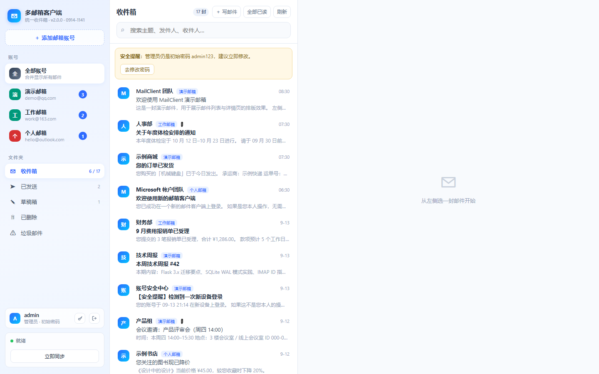
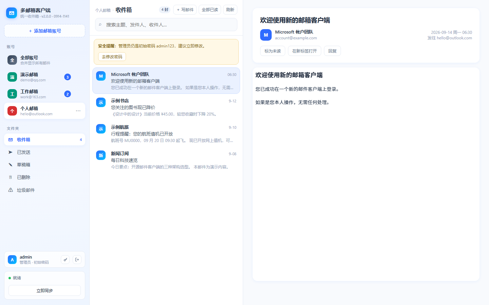
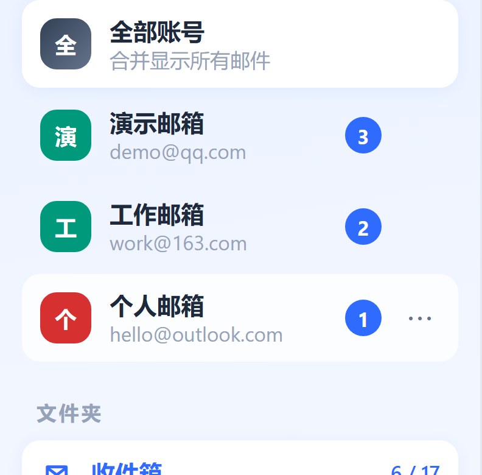
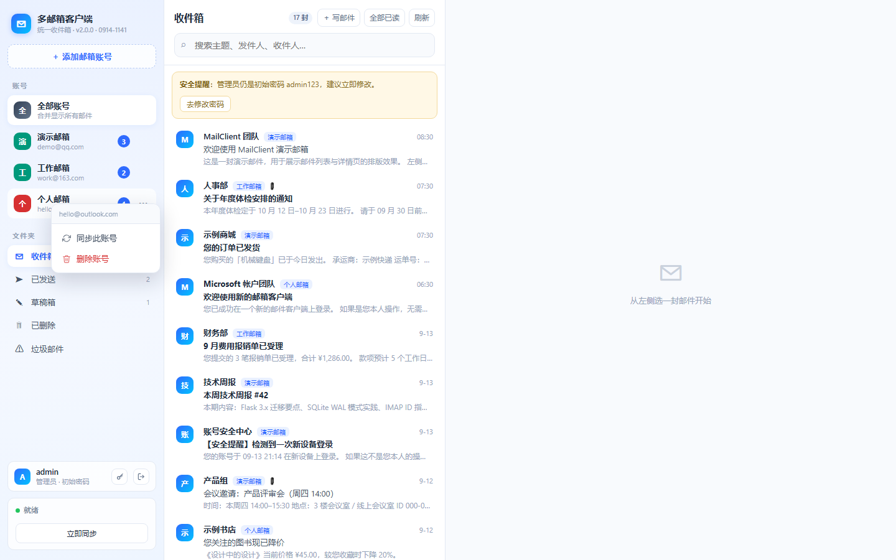
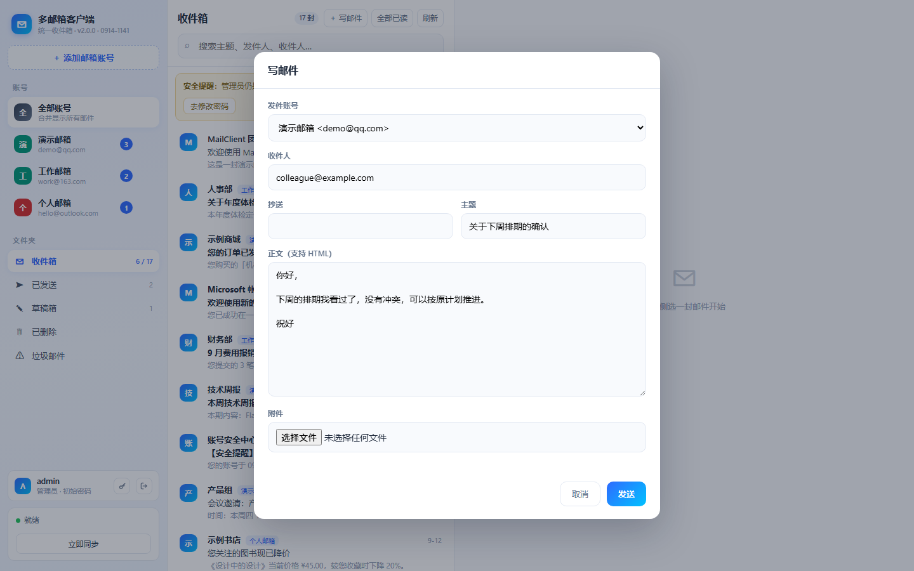
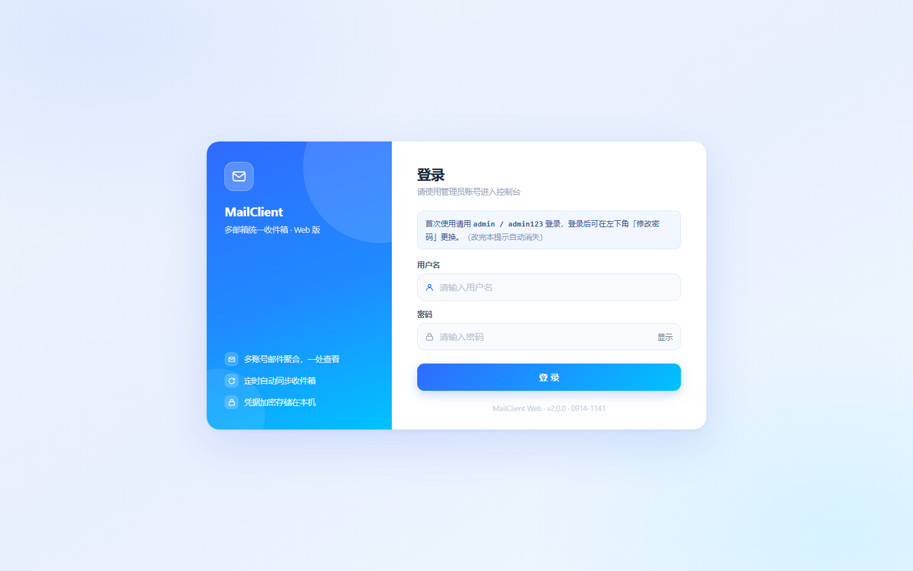
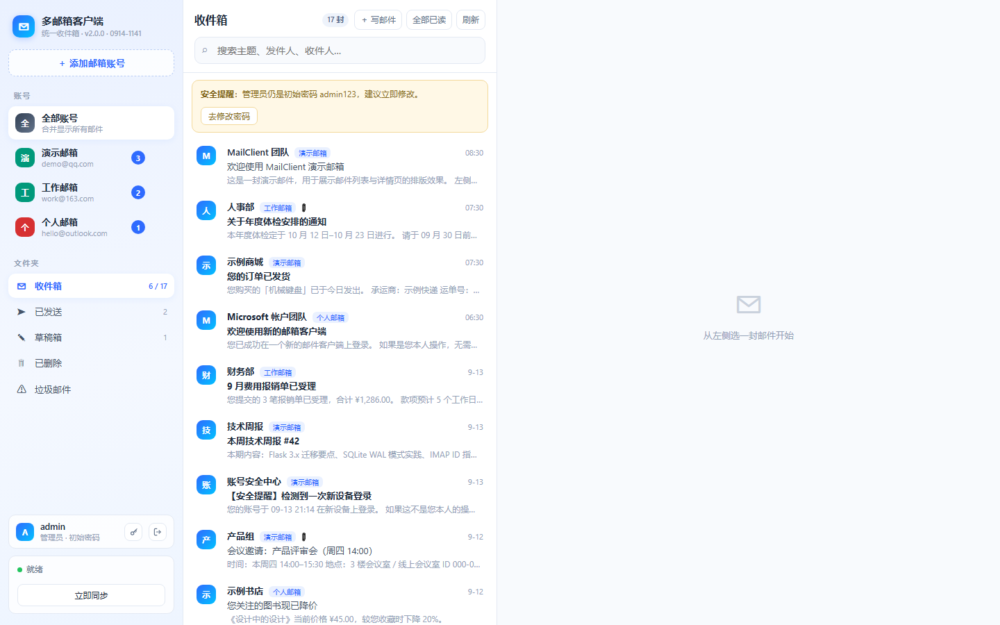

# MailClient Web · 多邮箱统一收件箱（Flask 版）

把桌面版（PySide6）的多邮箱客户端搬到了浏览器里，一台机器跑起来，
手机、平板、公司电脑都能打开同一个收件箱。协议层（IMAP / OAuth2 / 解析）与桌面版同一套，
只是把 QThread 换成了普通线程、把 keyring 换成了加密的 SQLite 存储。


## 能做什么

- **多账号合并收件箱**：左栏按账号 + 文件夹（收件箱 / 已发送 / 草稿箱 / 已删除 / 垃圾邮件）过滤，中栏列表，右栏详情
- **真实同步**：`UID SEARCH` + `UID FETCH`，一次同步 5 类文件夹；用 `BODY.PEEK[]` 保证**不会把你的邮件偷偷标成已读**
- **已读回写**：在网页上点开邮件，状态会推回 IMAP 服务器
- **写 / 发邮件**：支持抄送、密送、附件；已发送会自动 `APPEND` 到服务器「已发送」
- **微软账号 OAuth2**：Outlook / Hotmail / M365 走设备码流程（`XOAUTH2`），不再受「基础认证已停用」影响
- **账号管理**：添加账号时**自动按邮箱后缀识别服务商**（内置 QQ / 网易 / Outlook / Gmail / 新浪 / 阿里 / 139 / 企业邮 / 189 / iCloud / Yahoo 等 15 种预设）；在左侧账号上**右键**，或点该行右侧的 **⋯**，都可以「同步此账号 / 删除账号」（删除会一并清除该账号的本地邮件、文件夹与凭据）
- **密码加密落库**：QQ / 163 等授权码用 Fernet 对称加密存在库里，密钥独立成文件
- **账号密码登录**：用户名 + 密码进入，首次启动自动建管理员 `admin / admin123`，登录后可在左下角**修改密码**（详见「登录与账号」）；密码 PBKDF2-SHA256 加盐哈希存库，连续失败 5 次锁定 5 分钟







右键任意账号行，或点该行右侧的 ⋯，都可以打开同一个菜单：






## 目录结构

```
MailClientWeb/
├── app.py            # Flask 主程序：页面 + JSON 接口
├── config.py         # 数据目录、服务商预设、运行参数
├── auth.py           # 登录用户：建号 / 密码哈希 / 失败限流 / 改密码
├── db.py             # SQLite 存储层（账号 / 邮件 / 附件 / 凭据 / 文件夹映射 / 登录用户）
├── accounts.py       # 密码加密存储（Fernet）
├── mail_conn.py      # IMAP 连接、鉴权、文件夹自动发现
├── parser.py         # 邮件解析与按文件夹拉取
├── oauth.py          # 微软 OAuth2 设备码流程
├── msauth.py         # 把设备码流程包成「发起 → 轮询状态」两个接口
├── sender.py         # SMTP 发信（附件走内存字节）
├── sync.py           # 后台同步线程 + 可轮询状态
├── templates/        # index.html（三栏）、login.html
├── static/           # app.css、app.js（原生 JS，无构建步骤）
├── Dockerfile
├── docker-compose.yml
├── packaging/fnos/   # 飞牛 .fpk 打包工程
│   ├── manifest          # 应用元信息（名称 / 版本 / 端口 / 桌面入口）
│   ├── config/           # privilege（运行身份）、resource（docker 项目 + 数据共享目录）
│   ├── cmd/              # 生命周期脚本：安装 / 升级 / 卸载 / 启停状态
│   ├── wizard/install    # 安装向导（填初始密码、同步间隔、基础镜像地址）
│   ├── app/docker/       # FPK 用的 compose + 随包源码（打包时自动同步）
│   │   ├── base-image.tar.gz       # 离线基础镜像 python:3.12-slim（约 44 MB，见下文）
│   │   └── ensure-base-image.sh    # 安装时导入/校验基础镜像，网络不可用时兜底
│   ├── app/ui/           # 桌面图标与入口配置
│   ├── fetch-base-image.py  # 从国内镜像站取基础镜像，组装成 docker save 格式
│   ├── build-fpk.py      # 一键打包 + 自检
│   └── fnpack.exe        # 飞牛官方打包工具
├── dist/             # 打包产物：mailclientweb.fpk
└── docs/             # 界面截图
```

## 一、本地直接跑（不用 Docker）

```bash
# 1) 装依赖（建议用虚拟环境）
python -m venv .venv && .venv/Scripts/activate      # Windows
pip install -r requirements.txt

# 2) 起服务（无需任何环境变量，首次启动会自动建管理员账号）
set APP_PORT=8090
python app.py
```

**Linux / macOS：**

```bash
python3 -m venv .venv && source .venv/bin/activate
pip install -r requirements.txt
APP_PORT=8090 python app.py
```

打开 `http://127.0.0.1:8090`，用 **admin / admin123** 登录（登录后请到左下角「修改密码」更换）。
默认数据落在项目下的 `data/` 目录。

> 想跳过初始密码、在第一次启动就直接设成自己的密码？
> 设 `AUTH_PASSWORD=你的强密码` 再启动（**只影响首次建号**，之后改密码都在界面上做）；
> 不想在命令行写明文，就把它写进文件：`AUTH_PASSWORD_FILE=./data/.auth`。

## 二、Docker 部署（推荐）

```bash
# 1)（可选）预设初始密码；不设则首次登录用 admin / admin123
echo AUTH_PASSWORD=你的强密码 > .env

# 2) 构建并启动
docker compose up -d
docker compose logs -f          # 看日志
```

> **不想自己构建？** 仓库自带 GitHub Actions：推到 `main` 就会自动构建镜像并发布到
> `ghcr.io/<你的用户名>/mailclientweb`。首次发布后记得去
> **GitHub → 你的 Packages → mailclientweb → Package settings → Change visibility** 改成 Public，
> 别人才能直接 `docker pull`。一条命令就能跑起来：
>
> ```bash
> docker run -d --name mailclient -p 8090:8090 -v ./data:/data \
>   ghcr.io/<你的用户名>/mailclientweb:latest
> ```
```

打开 `http://<机器IP>:8090` 登录。

### 飞牛 NAS：应用中心一键安装（.fpk，推荐）

安装包在 `dist/mailclientweb.fpk`（约 **44 MB**，体积主要是包内自带的离线基础镜像，
原因见下面「为什么包里要带一个 44 MB 的镜像」），装好后和飞牛自带应用一样出现在桌面。

1. 把 `mailclientweb.fpk` 传到 NAS 上任意目录（比如 `/vol1/1000/`）
2. 打开 **应用中心 → 右上角「设置」→ 手动安装应用**，选中这个文件
3. 安装向导里填两项：**管理员初始密码**（默认 `admin123`）、**自动同步间隔**（默认 10 分钟）
   （第三页的「基础镜像地址」一般不用动）
4. 等它装完 —— 安装过程会顺手把应用镜像构建好，**首次需几分钟**（主要花在装 Python 依赖）
5. 装好后桌面出现「MailClient 邮箱」图标，点开即 `http://<NAS的IP>:8090`，用 `admin` + 你设的密码登录

#### 为什么包里要带一个 44 MB 的镜像？（遇到「无法安装」看这里）

国内网络**直连 Docker Hub 会超时**（`registry-1.docker.io` 连不上）。而飞牛安装 Docker 应用时
会自己跑 `docker compose up`，镜像不存在就**现场构建**，于是构建第一步 `FROM python:3.12-slim`
就挂掉，安装界面直接报「**无法安装**」，错误长这样：

```
Warning: Get "https://registry-1.docker.io/v2/": net/http: request canceled
  while waiting for connection (Client.Timeout exceeded while awaiting headers)
failed to solve: python:3.12-slim: failed to resolve source metadata
  for docker.io/library/python:3.12-slim
```

所以打包时会把 `python:3.12-slim`（linux/amd64）提前下载好，做成 `docker save` 格式的
`base-image.tar.gz` 一起塞进包里。安装时 `cmd/install_callback` 会：

1. `docker load` 导入这份离线镜像，并**真的跑一次 `python -V`** 验证
   （能 `inspect` 不等于能跑，损坏的镜像必须筛掉）
2. 把它打成 compose 里 `PY_BASE` 那个名字的标签 —— 构建器于是直接用本地镜像，**一次网络请求都不发**
3. 万一离线镜像出问题，才按 `docker.1panel.live → docker.m.daocloud.io → docker.1ms.run → …`
   的顺序去国内镜像站拉取兜底

也就是说：**装这个包，NAS 不需要能访问任何镜像仓库**。（pip 依赖默认走清华源，
可用构建参数 `PIP_INDEX` 换源；这一步若也失败，用下面的 SSH 方式手动重试。）

想要一个很瘦的包（约 60 KB）就加 `SKIP_BASE_IMAGE=1`，但那样 NAS 必须能连上镜像站才装得上：

```bash
SKIP_BASE_IMAGE=1 python packaging/fnos/build-fpk.py
```

> **构建失败了怎么办**：安装阶段构建失败**不会**中断安装；SSH 进 NAS 补一次即可
>
> ```bash
> docker compose -f /var/apps/mailclientweb/app/docker/docker-compose.yaml build
> ```
>
> 构建日志：`/usr/local/apps/mailclientweb/build.log`
>
> 也可以干脆自己 build 好再装：`docker build -t mailclientweb:2.0.0 .`（在项目根目录执行）。

数据落在飞牛的 data-share 里，**覆盖安装、升级都不会丢，卸载也保留**。

改完代码想重新打包：

```bash
python packaging/fnos/build-fpk.py
```

这个脚本会自动做四件事：准备/复用离线基础镜像（`fetch-base-image.py`）、把源码同步进包
（白名单，绝不带上 `data/`）、调飞牛官方 `fnpack` 打包、对产物做一轮自检
（结构完整性 / JSON 合法性 / 脚本行尾 / 敏感文件扫描 / **离线镜像各层 diffID 校验**）。

**两个注意点：**

- **端口**：应用固定用 `8090`。如果你 NAS 上这个端口已被占用，安装后会起不来 ——
  要改的话得同步改三个地方：`packaging/fnos/manifest` 的 `service_port`、
  `app/docker/docker-compose.yaml` 的 `ports`、`app/ui/config` 的 `port`，然后重新打包。
- **架构**：飞牛目前**只支持 x86_64** 的第三方应用（manifest 里 `platform = x86`）。
  ARM 版飞牛装不了，等官方放开后可改用 `fnpack create --template docker` 重新生成 ARM 包。

### 飞牛 NAS：Docker 项目方式

用飞牛自带的 **Docker → 项目 / Compose → 新建**：

1. 把整个 `MailClientWeb` 目录传到 NAS（比如 `/vol1/1000/docker/MailClientWeb`）
2. 项目里粘贴 `docker-compose.yml` 的内容（或指向该目录）
3. 端口默认映射 `8090`；若被占用，把 `ports` 左边改成 `9080` 之类
4. 构建并启动。数据会落在同目录的 `data/` 下，升级镜像不会丢

> 老版本 Docker 若报 `depends_on` 相关错误：本项目不依赖它，直接删掉即可。
> 用 SSH 部署的话，在项目目录执行 `docker compose up -d` 一样。

## 三、环境变量

| 变量 | 默认 | 说明 |
|---|---|---|
| `APP_PORT` | `8090` | 监听端口（容器内） |
| `APP_HOST` | `127.0.0.1` | 监听地址；容器里必须是 `0.0.0.0` |
| `DATA_DIR` | 项目下 `data/` | 数据库、令牌、密钥的存放目录 |
| `AUTH_PASSWORD` | 无 | **仅用于首次建号的初始密码**；不设则初始为 `admin123`。之后改密码都在界面上做 |
| `AUTH_PASSWORD_FILE` | 无 | 初始密码从文件读（Docker / K8s secret 模式，命令行不暴露明文）；`AUTH_PASSWORD` 为空时生效 |
| `AUTH_DISABLED` | 无 | 仅本机调试：设 `1` 可临时关闭登录校验（启动日志会警告），**切勿在公网使用** |
| `SYNC_INTERVAL_MINUTES` | `10` | 自动同步间隔；`0` = 关闭定时同步 |

## 三·五、登录与账号



| 项 | 说明 |
|---|---|
| 初始账号 | `admin` / `admin123`（首次启动自动创建，登录页会给出提示） |
| 修改密码 | 主界面**左下角用户卡片 → 钥匙图标**（也可点顶部提醒条的「去修改密码」），需输入当前密码；至少 6 位，不能与旧密码相同，也不能再用 `admin123` |
| 密码存储 | PBKDF2-SHA256 加盐哈希（`werkzeug.security`），库里没有明文 |
| 防爆破 | 同一用户名连续失败 5 次锁定 5 分钟；用户名不存在时也走一次哈希校验，避免时序探测 |
| 退出登录 | 左下角用户卡片 → 退出图标（清空会话） |
| 忘记密码 | 直接清掉用户表再重启即可恢复初始账号：`sqlite3 data/mail_client.db "DELETE FROM users;"` |



> 初始密码 `admin123` 是**公开的弱密码**：只要没改，中栏顶部会一直挂着橙色提醒条，登录页也会写明默认账号。
> 放到公网前务必先改密码，或者首次启动就用 `AUTH_PASSWORD` 注入强密码。


## 四、数据与安全（请读完）

`DATA_DIR` 里有四样东西，**都在一个卷里**，删掉就等于重置全部数据：

| 文件 | 内容 |
|---|---|
| `mail_client.db` | 账号、邮件缓存、附件、加密后的授权码、登录用户（密码哈希） |
| `oauth_tokens.json` | 微软 OAuth2 令牌（访问令牌 + 刷新令牌） |
| `cred.key` | 授权码的加密密钥 |
| `flask_secret.key` | 会话签名密钥（有了它，重启后浏览器不掉线） |
| `.auth`（可选） | 用 `AUTH_PASSWORD_FILE` 方式时存放的初始密码明文 |

需要说清楚的边界：**密钥和数据放在同一台机器上**，能读到 `/data` 的人就能解出授权码。
对「自己的 NAS / 家庭内网」这种私有部署是合理权衡，但它**不是「零信任 / 零知识」方案**。
所以：

- 放公网请在前面套一层反向代理 + HTTPS，并**先把 admin 的密码改掉**（不要留 admin123）
- 不要把这个 `data/` 目录提交到 Git 或分享给别人

## 五、支持的邮箱

| 服务商 | 登录方式 | 备注 |
|---|---|---|
| QQ / Foxmail | 授权码 | 网页版 QQ 邮箱 → 设置 → 账号 → 开启 IMAP/SMTP → 生成授权码 |
| 163 / 126 / Yeah（网易） | 授权码 | 不是登录密码；网易要求客户端登录后先上报 ID 身份，程序里已自动处理 |
| Outlook / Hotmail（个人） | **OAuth2** | 点「使用微软账号登录」走设备码流程；另需在网页版 Outlook 开启 IMAP |
| Microsoft 365（工作/学校） | **OAuth2** | 需管理员允许 IMAP |
| Gmail | 应用专用密码 | 开两步验证后生成 |
| 新浪邮箱 | 授权码 | 网页版开启 IMAP/SMTP 后用客户端授权码 |
| 阿里邮箱（钉钉/淘宝） | 授权码 | 设置里开启 IMAP/SMTP，用授权码登录 |
| 移动 139 邮箱 | 服务密码 / 授权码 | 手机端或网页版开启 IMAP/SMTP |
| 腾讯企业邮（企业微信邮箱） | 邮箱密码 / 专用密码 | 需管理后台开启 IMAP/SMTP |
| 电信 189 邮箱 | 授权码 | 设置里开启 IMAP/SMTP 后使用 |
| iCloud（Apple） | 应用专用密码 | 开两步验证后生成 |
| Yahoo 邮箱 | 应用专用密码 | 基础密码已停用，需应用专用密码 |
| 自定义 / 其他 | 密码 / 授权码 | 手动指定 IMAP / SMTP 地址与端口 |

> 输入邮箱地址后会自动按后缀匹配上表服务商，匹配不到就回退到「自定义」。


## 六、常见问题

**装 .fpk 时报「无法安装」，日志里有 `registry-1.docker.io ... Client.Timeout`**
国内直连 Docker Hub 被墙，安装时飞牛现场构建镜像卡在 `FROM python:3.12-slim`。
正常的 FPK 里已经带了离线基础镜像，安装时会自动 `docker load`，不会去连 Docker Hub；
所以先确认你用的是**新打的包**（约 44 MB）而不是早前那个 60 KB 的。
若仍然失败，SSH 上 NAS 看 `/usr/local/apps/mailclientweb/build.log`，并手工补一次：
`docker compose -f /var/apps/mailclientweb/app/docker/docker-compose.yaml build`。
详见上文「为什么包里要带一个 44 MB 的镜像」。

**Outlook 显示「登录已被微软接受，但微软拒绝打开邮箱」**
这不是密码问题。个人微软账号默认不开 IMAP，去网页版邮箱
「设置 → 邮件 → 转发和 IMAP」打开「允许设备和应用使用 IMAP」并保存，再点「立即重试」。
若同一邮箱短时间内被多个客户端连过，微软会临时限流，一般 2–6 小时自解。

**Outlook 发信报 `535 5.7.139 SmtpClientAuthentication is disabled`**
微软在服务端关掉了该邮箱的 SMTP 发信。个人 outlook.com 账号没有开关能自己打开，
建议换其它账号发信，或直接用网页版 Outlook。

**QQ / 163 登录被拒绝**
用「授权码」而不是登录密码。

**网易邮箱（163 / 126 / Yeah）能连上，但一封邮件都收不到**
报错会是 `EXAMINE Unsafe Login. Please contact kefu@188.com for help`。
这是网易/Coremail 的额外要求：**客户端登录成功后必须先发一条 `ID` 指令自报身份**，
否则后续任何读信操作都会被拒——注意它连 `LOGIN` 都是成功的，所以光看「能不能连上」查不出来。
Python 标准库 `imaplib` 的命令表里没有 `ID`，本程序在 `mail_conn.py` 里手工补发了这条命令。
若你用的是**不常见的 Coremail 系域名**（企业邮、`coremail.cn` 等）也踩到同样的报错，
把域名加进 `mail_conn.py` 顶部的 `_ID_SUFFIXES` 即可。

**界面上看不到右键菜单 / 按钮排版怪怪的 / 改了代码界面纹丝不动**
先把「浏览器缓存」排掉——这是最容易误判成 bug 的一类问题：

1. **看构建号**：侧栏标题下面和登录页页脚都会显示构建号（形如 `v2.0.0 · 0914-1141`），
   它是服务端渲染的，**页面不新就不会显示**；没显示（或显示的是旧时间）就是缓存问题，按一次 `Ctrl+F5`。
2. 页面（`/` 与 `/login`）已设 `Cache-Control: no-store`，静态资源带文件指纹（`?v=<mtime>`），
   所以强制刷新**只需要一次**，之后每次刷新都会自动拿到最新版。
3. 页面还会每 60 秒对一次 `/api/version`（顺带比对 HTML 里的构建号），
   服务端换新版后，页面上方会自己弹出「已发布新版本，刷新后生效」的提示条。

> 排查这类问题的通用手法：看浏览器开发者工具的 Network 面板，
> 文档本身应该是 `no-store`，`app.css` / `app.js` 应该带 `?v=` 且与磁盘文件一致。

**邮件列表是空的 / 附件下不下来**
先点左下角「立即同步」拉一次。若报鉴权类错误，界面上会直接给出对应的处理建议和跳转链接。

## 七、和桌面版的关系

桌面版在 `../MailClient`（PySide6 + PyInstaller 打包），逻辑层几乎一模一样：
`mail_conn.py` / `parser.py` / `oauth.py` 三个文件是直接复用的。
两个版本可以同时用，数据库结构兼容，但**数据目录各自独立**，互不影响。

版本：`2.0.0`
