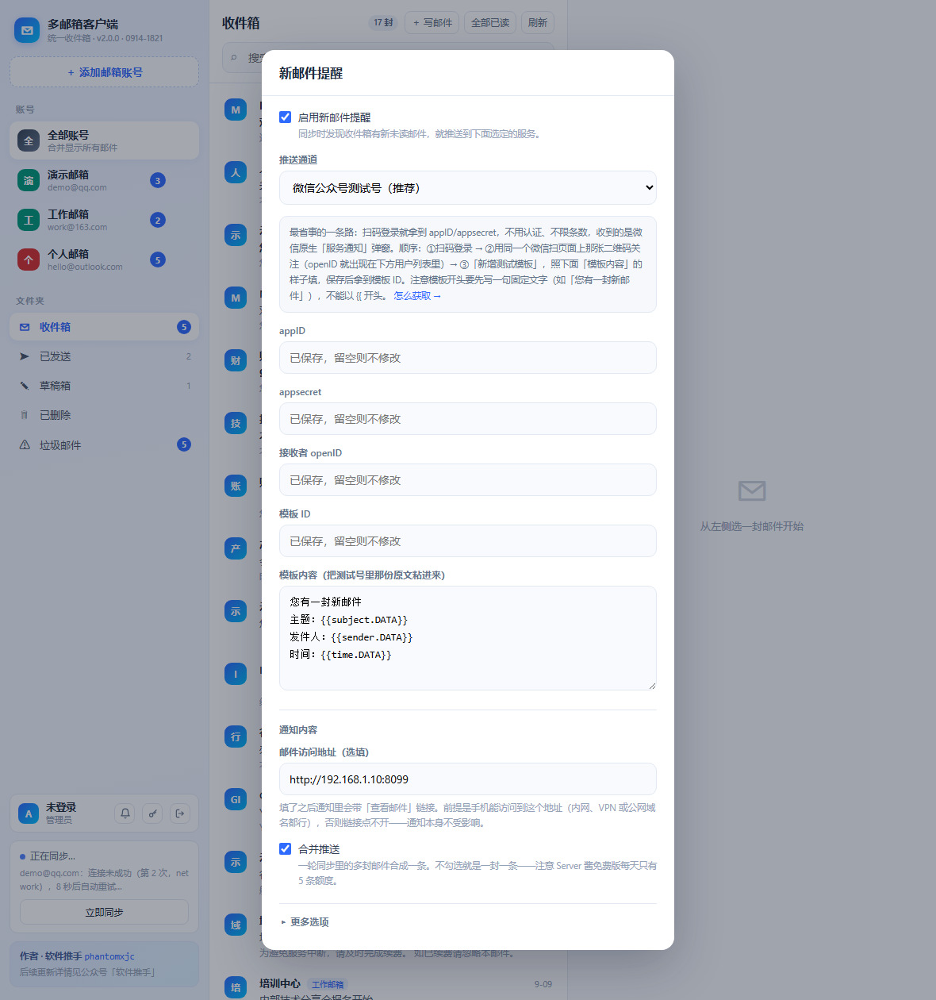

# 用微信公众号测试号接收新邮件提醒

> 这是「新邮件提醒」里最推荐的一个通道：**不用认证、不用备案、不用付费、没有条数焦虑**，
> 收到的是微信原生的「服务通知」弹窗，点开直接跳回邮件。
> 从零到收到第一条测试通知，熟练的话 5 分钟。

---

## 一、先说清楚它是什么

「微信公众平台测试号」是微信官方给开发者用的沙盒账号：扫码就能拿 `appID` / `appsecret`，
不需要企业主体、不需要认证（300 元/年那个）、不需要服务器域名备案。

它保留了正式服务号早期的「模板消息」接口 —— 正式号早就改成订阅通知了，测试号一直没动。
所以这条路能走通。

和另外两个微信通道比：

| | 微信测试号 | Server 酱 | PushPlus |
|---|---|---|---|
| 需要认证 | 不用，扫码即得 | 不用 | **需要实名认证** |
| 条数限制 | 无（测试号接口额度对个人用量绰绰有余） | 免费版 5 条/天 | 免费 |
| 消息形态 | 微信原生「服务通知」 | 服务号推送 | 服务号推送 |
| 中转方 | **没有中间商**，你的服务器直连微信 | 方糖服务器 | PushPlus 服务器 |
| 配置复杂度 | 4 个参数（要走 3 小步） | 1 个 Key | 1 个 Token |

代价就是配置比「填一个 Key」麻烦一点 —— 本文就是来解决这个的。

---

## 二、配置步骤

### 第 1 步：拿到 appID 和 appsecret

1. 浏览器打开测试号申请页：

   <https://mp.weixin.qq.com/debug/cgi-bin/sandbox>

2. **用微信扫码登录**（手机上确认一下就行，不用注册）。

3. 登录后页面顶部就是这两个值，直接复制：

   ```
   appID：  wx8f3c2a91d4e7b605        （wx 开头，18 位左右）
   appsecret：9c1d4f7a2e6b8035d7f1a4c8e2b60937
   ```

> 这两个值以后随时都能回来页面看，不用怕丢。但也别外传 —— 拿到它们就能以你的名义发消息。

### 第 2 步：关注这个测试号，拿到 openID

测试号只会给**关注了它的人**发消息，所以得先让"你自己"成为它的粉丝。

1. 回到测试号页面，往下找到**「测试号二维码」**那张图（页面中部偏右）。

2. **用你平时收消息的那个微信**扫它 → 关注（就是普通的关注公众号动作）。

   这一步看似多此一举（明明是自己给自己发），但 openID 是微信给每个用户在每个公众号下的
   唯一编号，不关注就拿不到。

3. 关注后**刷新一下测试号页面**，中部「用户列表」里会出现一条记录：

   ```
   微信号                      昵称        openID
   your_wechat_id             你的昵称     o6_bmjrPTlm6_2sgVt7hMZOPfL2M
   ```

4. 复制那个 **openID**（`o` 开头的一长串）。

> 想推给多个人？让对方的微信也扫这张二维码关注，把他们的 openID 用**英文逗号**隔开填进来就行。

### 第 3 步：建模板，拿到 template_id

微信的模板消息不允许"自由发挥"文本，必须先在后台定义一个带占位变量的模板。

1. 在测试号页面找到**「模板消息接口」**区域，点 **「新增测试模板」**。

2. **模板标题**随便填，比如 `新邮件提醒`。

3. **模板内容**照下面原样粘贴（换行也要保留）：

   ```
   您有一封新邮件
   主题：{{subject.DATA}}
   发件人：{{sender.DATA}}
   时间：{{time.DATA}}
   ```

4. 保存后，下面的模板列表里会多出一行，把它那串 **模板 ID** 复制下来：

   ```
   kV7bNq3xRpZmL8dT5yWcJhQ2sXgEfAu9-Mn4Yt6Bw
   ```

**这一步最容易踩的两个坑**：

- **模板内容不能以 `{{` 开头**。第一行必须先写一句固定文字（上面写的「您有一封新邮件」就是干这个的），
  否则微信会拒绝保存。
- **变量名写成 `{{名字.DATA}}`**，中间那个**点**不能少，`DATA` 必须大写。

**变量名可以自己起**，程序会按关键词猜它该填什么：

| 变量名里含这些词 | 实际填入 |
|---|---|
| `subject`、`title`、`主题`、`标题` | 邮件主题 |
| `sender`、`from`、`发件`、`发送者` | 发件人 |
| `time`、`date`、`时间`、`日期` | 收到时间 |
| `account`、`email`、`mail`、`账号`、`收件` | 收件账号 |
| `remark`、`note`、`content`、`body`、`内容`、`备注`、`摘要` | 邮件摘要（合并推送时是「主题1；主题2…」） |
| `count`、`num`、`数量` | 本次几封 |

认不出来的变量名一律填摘要，所以就算写 `{{aaa.DATA}}` 也不会收到空白。
模板里写几个变量，就只给这几个变量赋值 —— 微信对"多传"是忽略、"少传"才会报错，
所以**建议把模板原文整段粘到应用的「模板内容」框里**，程序据此精确对齐。

### 第 4 步：填进应用



1. 主界面左下角用户卡片 → **铃铛图标**。
2. 勾上「启用新邮件提醒」。
3. 推送通道选 **「微信公众号测试号（推荐）」**。
4. 四个框依次填：`appID` → `appsecret` → 接收者 `openID` → 模板 ID。
5. 「模板内容」框把**测试号页面里那份模板原文**整段粘进来（换行保留）。这个值会回显，
   下次打开还在，不用重复粘。
6. 「邮件访问地址」选填，见下面第五节。
7. 点 **「发送测试」**。成功会提示：

   ```
   测试已发出 · errcode=0，已送达 1 个接收者
   ```

   同时手机上微信「服务通知」会弹一条消息。
8. **最后点「保存」**（发送测试只是试发，不会保存配置）。

---

## 三、收到的是什么样

手机上是一条微信原生通知：

```
──────────────────
服务通知
──────────────────
您有一封新邮件
主题：月度报表已生成
发件人：张三 <zhangsan@example.com>
时间：2026-09-14 15:00
──────────────────   点整条卡片可跳转
```

点整条卡片 → 跳到「邮件访问地址」指向的页面，并直接打开那封邮件。

---

## 四、报错对照表

「发送测试」把微信返回的原始 `errcode` 翻译成人话了，对照着改就行：

| 提示 | 真实原因 | 怎么处理 |
|---|---|---|
| appsecret 不正确 | 复制时漏字符、或复制了含空格的 | 回测试号页面重新复制一遍，注意首尾别带空格 |
| appID 不合法 | 同上 | 核对是不是 `wx` 开头那一串 |
| 收件人还没关注这个测试号 | openID 对应的微信没关注 | 用同一个微信扫页面上的二维码关注；或核对 openID 是不是复制错了 |
| 模板参数对不上（47003） | 「模板内容」和真实模板不一致 | 把测试号里那份模板原文**整段**粘到应用的「模板内容」框 |
| template_id 无效 | 模板 ID 复制错了 | 回模板列表重新复制 |
| 接口调用频率超限 | 短时间发太多了 | 等一会儿；把「最小推送间隔」设成 15 分钟 |
| 调用来源 IP 不在白名单 | 少见，正式号才有这问题 | 一般不用管；真遇到就换测试号，或把出口 IP 加进白名单 |

---

## 五、几个要知道的细节

**通知里的链接**。只有填了「邮件访问地址」，通知卡片才可点击跳转，格式是
`<你的地址>/#mail=<邮件id>`。这个地址必须是**手机上访问得到**的（同内网网段、VPN、或公网域名），
写在 NAS 上跑的服务，填 `http://192.168.1.10:8090` 这种局域网地址在家里能点开、在外面点不开。
留空的话通知照收，只是点了没反应。

**access_token 是缓存的**。调微信接口要先换一张 7200 秒有效期的「票」，程序把票缓存在库里，
快过期才去换（微信对换票次数有每日限额，不能每发一条就换一次）。
所以改了 `appID` / `appsecret` 之后，如果提示不对劲，重新点一次「发送测试」就会强制换票重试 ——
程序遇到 `40001` / `42001` 本身也会自动换票重发一次。

**条数**。测试号的模板消息额度对个人收邮件这个量级完全够用（不是 5 条/天那种免费版限制）。
真怕被轰炸，用「最小推送间隔」和「免打扰」两个开关控制。

**首次同步不提醒**。新加一个邮箱账号时，第一次会把整个收件箱拉进来，那不是「新邮件」，
所以整批静默入库，不会一次给你推上百条。

**凭据怎么存的**。`appsecret` 和 `openID` 跟邮箱授权码共用同一把 Fernet 密钥加密后存库，
界面上只显示「已保存，留空则不修改」，不回传明文。「模板内容」不算密钥，所以会正常回显。

**测试号会不会失效**。它是微信官方的长期沙盒环境，正常用没问题；但如果哪天真的收不到了，
回测试号页面看一眼 `appsecret` 是否还在，重新复制一遍即可。
